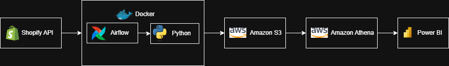

# Shopify Analytics Pipeline

An end-to-end data pipeline that extracts data from any Shopify store, loads it into AWS (S3 + Athena), and enables visualization in Power BI. Built with Python, Apache Airflow, and Docker.


## Overview

This pipeline automates the extraction of Shopify store data (orders, products, customers, and line items), uploads it to Amazon S3, creates queryable tables in Amazon Athena, and connects to Power BI for business intelligence dashboards.

**Built in production for [Doggles Inc.](https://doggles.com)** — a pet eyewear and accessories company processing 500+ SKUs.

### What You Can Analyze

- **Top selling products** by units sold and revenue
- **Sales trends** over time
- **Customer insights** — top spenders, geography, repeat buyers
- **Inventory levels** — stock quantities across all variants
- **Product variant performance** — which colors/sizes sell best

## Architecture



### Data Flow

1. **Extract** — Python scripts pull data from the Shopify REST API (orders, products, customers, line items)
2. **Transform** — Pandas cleans and formats the data (type casting, column filtering, calculated fields)
3. **Load** — DataFrames are uploaded as CSV to S3, and Athena external tables are created/updated
4. **Orchestrate** — Airflow DAG runs the pipeline weekly (every Monday at 6 AM) via Docker
5. **Visualize** — Power BI connects to Athena via ODBC for interactive dashboards


## Project Structure

```
├── .env.example            # Template for environment variables
├── .gitignore              # Files excluded from version control
├── docker-compose.yml      # Docker services (Airflow + Postgres)
├── Dockerfile              # Airflow container build config
├── requirements.txt        # Python dependencies
├── dags/
│   └── shopify_to_AWS_dag.py       # Airflow DAG - weekly pipeline
├── etls/
│   ├── Shopify_Connect.py          # Shopify API connection handler
│   ├── Shopify_Get_Sales.py        # Orders extraction & transformation
│   ├── Shopify_Get_Inventory.py    # Products extraction & transformation
│   ├── Shopify_Get_Customers.py    # Customers extraction & transformation
│   ├── Shopify_Get_Line_Items.py   # Order line items extraction
│   ├── load.py                     # Local CSV export
│   └── load_to_aws.py              # S3 upload + Athena table creation
├── pipelines/
│   ├── Shopify_Pipeline.py         # Local pipeline (CSV only)
│   └── Shopify_Pipeline_AWS.py     # AWS pipeline (S3 + Athena)
└── utils/
    └── constants.py                # Environment variable configuration
```

## Getting Started

### Prerequisites

- [Docker Desktop](https://www.docker.com/products/docker-desktop/)
- A [Shopify](https://www.shopify.com/) store with a custom app (Admin API access)
- An [AWS account](https://aws.amazon.com/) with S3 and Athena access
- [Power BI Desktop](https://powerbi.microsoft.com/desktop/) (optional, for visualization)

### 1. Clone the Repository

```bash
git clone https://github.com/joed123/shopify-analytics-pipeline.git
cd shopify-analytics-pipeline
```

### 2. Configure Environment Variables

Copy the example env file and fill in your credentials:

```bash
cp .env.example .env
```

Edit `.env` with your values:

```
SHOPIFY_STORE=your-store-name
SHOPIFY_ACCESS_TOKEN=shpat_your_token_here
AWS_ACCESS_KEY_ID=your_aws_key
AWS_SECRET_ACCESS_KEY=your_aws_secret
AWS_REGION=us-east-2
S3_BUCKET_NAME=your-bucket-name
ATHENA_DATABASE=shopify_data
```

### 3. Set Up AWS

Create an S3 bucket with this folder structure:

```
s3://your-bucket-name/
    ├── shopify/
    │   ├── orders/
    │   ├── products/
    │   ├── customers/
    │   └── line_items/
    └── athena-results/
```

Create an IAM user with these policies:
- `AmazonAthenaFullAccess`
- `AmazonS3FullAccess`

### 4. Set Up Shopify

Create a custom app in your Shopify admin under **Settings → Apps and sales channels → Develop apps**:

Required API scopes:
- `read_orders`
- `read_products`
- `read_customers`
- `read_inventory`

### 5. Build and Run

```bash
docker-compose build
docker-compose up -d
```

Access Airflow at `http://localhost:8080` (default login: `airflow` / `airflow`).

### 6. Trigger the Pipeline

In the Airflow UI, find the `shopify_to_aws_weekly` DAG and click the play button to trigger it manually. The pipeline will:

- Extract orders, products, customers, and line items from Shopify
- Upload CSV files to your S3 bucket
- Create/update Athena external tables

### 7. Connect Power BI

1. Install the [Amazon Athena ODBC driver](https://docs.aws.amazon.com/athena/latest/ug/odbc-v2-driver.html)
2. Set up a System DSN in ODBC Data Sources (64-bit):
   - **Driver:** Simba Athena ODBC Driver
   - **Region:** your AWS region
   - **S3 Output Location:** `s3://your-bucket-name/athena-results/`
   - **Database:** `shopify_data`
   - **Auth Type:** IAM Credentials
3. In Power BI, go to **Get Data → Amazon Athena**, enter your DSN name, and load your tables

## Customization

### Adding New Data Sources

The pipeline is modular. To add a new Shopify data source:

1. Create an extraction script in `etls/` (see existing scripts for the pattern)
2. Add a schema definition in `load_to_aws.py` under `create_athena_table`
3. Add a pipeline function in `pipelines/Shopify_Pipeline_AWS.py`
4. Add a task in `dags/shopify_to_AWS_dag.py`

### Modifying Table Schemas

Edit the schemas in `etls/load_to_aws.py` to match the fields you need from the Shopify API. The default schemas cover common fields but can be customized for your store.

### Changing the Schedule

Edit the `schedule_interval` in `dags/shopify_to_AWS_dag.py`:

```python
# Every Monday at 6 AM
schedule_interval='0 6 * * 1'

# Daily at midnight
schedule_interval='0 0 * * *'

# Every 6 hours
schedule_interval='0 */6 * * *'
```

## Tech Stack

| Layer | Technology |
|-------|-----------|
| Extraction | Python, Requests, Shopify REST API |
| Transformation | Pandas |
| Storage | Amazon S3 |
| Query Engine | Amazon Athena |
| Orchestration | Apache Airflow 2.8.1 |
| Containerization | Docker, Docker Compose |
| Visualization | Power BI |

## Troubleshooting

**Athena returns NULL values:** Make sure your Athena tables use OpenCSV SerDe to handle quoted CSV fields properly. See the Athena table creation queries in the setup guide.

**Dates not showing in Power BI:** Dates come in as strings from Athena. In Power BI, go to Transform Data and change date columns to Date/Time type.

**Pipeline fails with permission errors:** Verify your IAM user has both `AmazonAthenaFullAccess` and `AmazonS3FullAccess` policies attached.

**Docker won't start:** Make sure Docker Desktop is running before executing `docker-compose` commands.

## License

MIT License — see [LICENSE](LICENSE) for details.

## Acknowledgments

Built for [Doggles Inc.](https://doggles.com) with permission. Doggles is a registered trademark of Doggles Inc.
